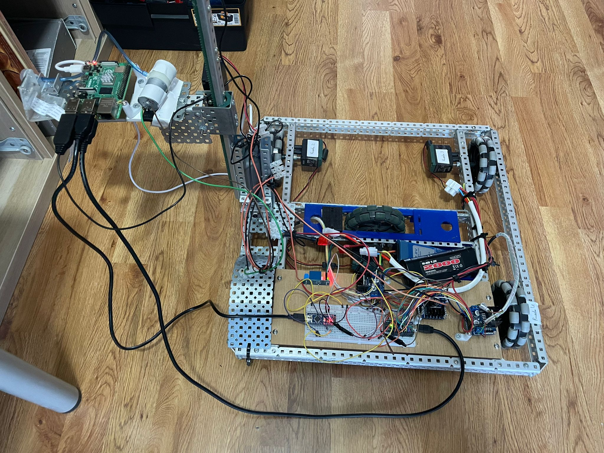
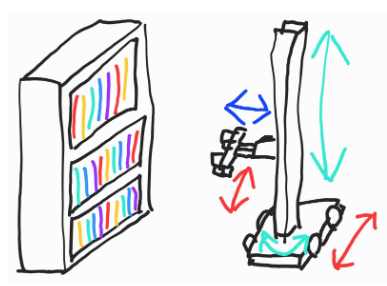
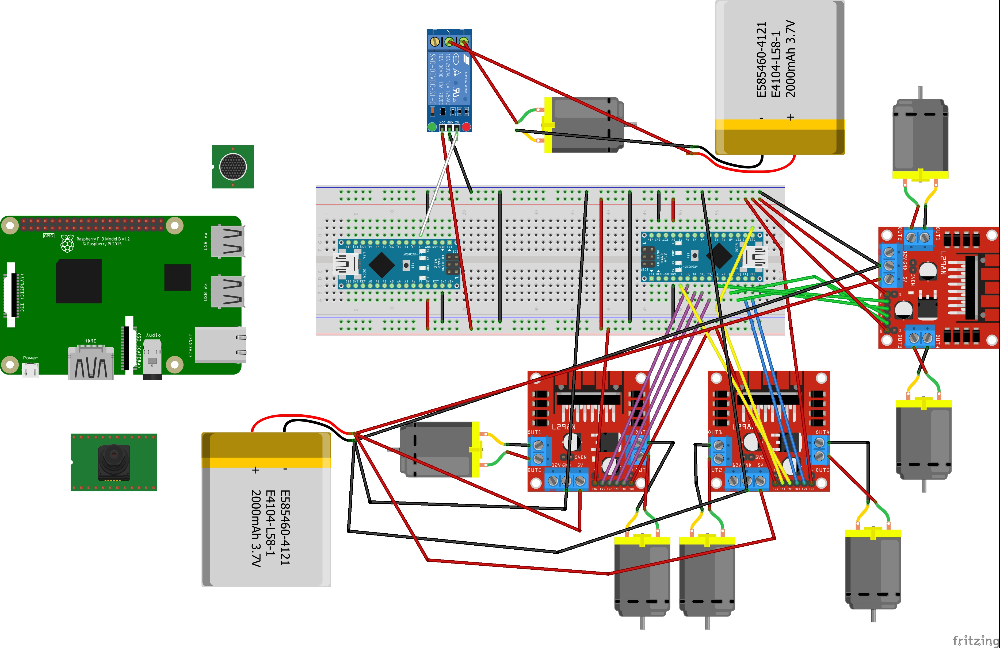
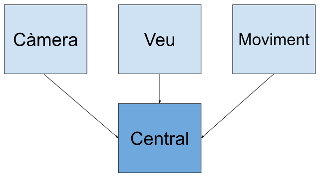

# Librobot
Robot que interactua amb una persona per buscar un llibre a les prestatgeries donant un títol per veu i que el succiona per poder-lo agafar.
<br> </br>



## Taula de continguts
1. [En què consiteix?](#en-que-consiteix)
2. [Requisits](#requisits)
3. [Com funciona?](#com-funciona)
4. [Contribucions Espectaculars](#amazing-contributions)
5. [Components](#components)
6. [Esquema de *hardware*](#esquema-de-hardware)
7. [Peces 3D](#peces-3d)
8. [Arquitectura de *software*](#arquitectura-de-software)
9. [Vídeo](#video)
10. [Contribucions](#contribucions)
11. [Citacions](#Citacions)
12. [Llicència](#llicencia)
13. [Autors](#autors)
14. [Bibliografia](#bibliografia)

<h2 id="en-que-consiteix">En què consiteix?</h2>
A continuació, presentem el nostre projecte final de l'assignatura de robòtica (RLP) a la Universitat Autònoma de Barcelona. Aquest robot és un sistema que inclou components físics i electrònics amb la capacitat de realitzar quatre moviments (graus de llibertat) diferents, cadascun dels quals implica una base mòbil davant d'un prestatge amb una barra vertical que mou un braç per agafar un llibre. El sistema utilitza una càmara, un micròfon per sol·licitar un llibre, una ventosa al final del braç i algorismes per identificar i localitzar llibres específics a la prestatgeria, i el braç està dissenyat per estendre's i arronsar-se, succionant els llibres i deixant-los a sobre d'un suport metàl·lic. Amb aquest punt de partida inicial establit, es faran servir una sèrie de components electrònics que permetràn posar en funcionament el robot ajustant-se a les restriccions de moviment anteriors. En aquest Git s'explicarà com vam construir el robot i què vam fer pel seu correcte funcionament.

<br/>
<i>Il·lustració inicial del robot (Rubén R.S.)</i>

<h2 id="requisits">Requisits</h2>
Per fer funcionar el robot fem servir els següents entorns:
<ul>
 <li>C++ (variant de l'Arduino)</li>
 <li>Python (Raspberry Pi)</li>
</ul>
A més d'incloure les següents llibreries:
<ul>
 <li>Math (C++)</li>
 <li>OpenCV (Pyhton)</li>
 <li>NumPy (Python)</li>
 <li>TensorFlow (Python)</li>
</ul>

<h2 id="com-funciona">Com funciona?</h2>
1. Clona aquest repositori:

   ```terminal
   git clone https://github.com/RubenRS040398/librobot.git
   ```

2. Instal·la les llibreries necessàries:

- Si es fa servir conda:

  ```terminal
  conda install -c menpo opencv3
  conda install numpy
  conda install -c conda-forge tensorflow
  ```
 
- Si es fa servir pip:

  ```terminal
  pip install opencv-python
  pip install numpy
  pip install tensorflow
  ```

<h2 id=amazing-contributions> Contribucions Espectaculars </h2>
El nostre robot està pensat per facilitar la feina a llibreters, personal de biblioteca i fins i tot a nivell industrial per magatzems. Òbviament el nostre robot és una versió petita i prototipada, feta a petita escala però escalable i portable a altres entorns o dimensions. Com que fa automàticament la tasca de buscar un nom d'un llibre, reconèixer-lo i agafarlo, fa més senzilla la tasca de buscar a prestatgeries i agafar un llibre. Això pot prevenir certs accidents laborals o riscos que poden patir les persones i/o treballadors al realitzar aquestes tasques. També pot ajudar a reduir l'estrés sobre el cos humà a l'estar de peu molt de temps, carregar amb molt de pes (pot prevenir el mal d'esquena a la gent que fa un esforç per poder estirarse, pujar a una escala per agafar un llibre...) i a més, com és interactiu al demanar el llibre per detecció de veu, és més divertit i accesible per més persones.
Per últim, cal destacar, com s'ha exposat abans, que el robot és escalable a altres entorns o funcionalitats. Pot fer-se servir per agafar o detectar llibres, però si es volgués, podria modificar-se per agafar algun altre tipus d'objecte. També es podria augmentar l'escala del robot;fer-lo més gran; amb una ventosa més potent o un sistema de recolecció d'objectes més ferm per poder agafar objectes més pesats; canviar el sistema de detecció d'onjectes per en comptes de detectar llibres detectar algun altre tipus d'objecte...
En resum, aquest robot contribueix a facilitar una tasca que pot ser feixuga per a certs tipus de persones i es pot escalar i portar a altres entorns i funcionalitats, tenint un potencial atractiu per poder modificar, canviar i implementar en altres necessitats.
<h2 id="components">Components</h2>
<table>
<thead>
  <tr>
    <th class="tg-c3ow"><span style="font-weight:bold">Nom</span></th>
    <th class="tg-c3ow"><span style="font-weight:bold">Quantitat</span></th>
    <th class="tg-c3ow"><span style="font-weight:bold">Imatge</span></th>
  </tr>
</thead>
<tbody>
  <tr>
    <td class="tg-c3ow">Arduino Nano</td>
    <td class="tg-c3ow">2</td>
    <td class="tg-c3ow"></td>
  </tr>
  <tr>
    <td class="tg-c3ow">Raspberry Pi 4b</td>
    <td class="tg-c3ow">1</td>
    <td class="tg-c3ow"></td>
  </tr>
  <tr>
    <td class="tg-c3ow">Bateries 7,2V</td>
    <td class="tg-c3ow">2</td>
    <td class="tg-c3ow"></td>
  </tr>
  <tr>
    <td class="tg-c3ow">Raspberry Pi Cam</td>
    <td class="tg-c3ow">1</td>
    <td class="tg-c3ow"></td>
  </tr>
  <tr>
    <td class="tg-c3ow">Micròfon USB</td>
    <td class="tg-c3ow">1</td>
    <td class="tg-c3ow"></td>
  </tr>
  <tr>
    <td class="tg-c3ow">Protoboard</td>
    <td class="tg-c3ow">1</td>
    <td class="tg-c3ow"></td>
  </tr>
  <tr>
    <td class="tg-c3ow">Relé</td>
    <td class="tg-c3ow">1</td>
    <td class="tg-c3ow"></td>
  </tr>
  <tr>
    <td class="tg-c3ow">Controladores</td>
    <td class="tg-c3ow">3</td>
    <td class="tg-c3ow"></td>
  </tr>
  <tr>
    <td class="tg-c3ow">Motors</td>
    <td class="tg-c3ow">6</td>
    <td class="tg-c3ow"></td>
  </tr>
  <tr>
    <td class="tg-c3ow">Succionador</td>
    <td class="tg-c3ow">1</td>
    <td class="tg-c3ow"></td>
  </tr>
</tbody>
</table>

<h2 id="esquema-de-hardware">Esquema de <i>hardware</i></h2>



<h2 id="peces-3d">Peces 3D</h2>
¿?

<h2 id="arquitectura-de-software">Arquitectura de <i>software</i></h2>
En la següent imatge es mostra l'esquema software que fa servir el nostre robot:

La implementació del robot es divideix en els següents mòduls operatius:
<ul>
 <li>Mòdul Central: Interconecta tots els mòduls.</li>
 <li>Mòdul Càmera: Conté l’algorisme de Visió per computador per reconèixer els títols dels llibres.</li>
 <li>Mòdul Veu: Conté l’algorisme de reconeixement de veu.</li>
 <li>Mòdul de moviment: Conté l’algorisme per controlar els moviments del robot. Tant del braç com de les rodes.</li>
</ul>
El primer que es fa és activar el mòdul de detecció de veu (s'escolta el llibre que es vol recollir). Seguidament, activem el mòdul de la càmera per veure si en la posició inicial es troba el llibre en la visió de la càmera. Tant si es troba com si no, activem el mòdul de moviment per poder moure el robot i encaixar-lo en una posició on tingui el llibre centrat amb el braç per poder-lo agafar.

<h2 id="video">Vídeo</h2>
¿?

<h2 id=contribucions>Contribucions</h2>
Tothom és lliure de contribuir amb qualsevol cosa que pugui potencialment millorar el projecte, sigui en temes de disseny, arquitectura del software, codi, components hardware... Qualsevol cosa és benvinguda, i apreciem les contribucions. Si et sents capaç, contacta amb el propietari d'aquest GitHub sense cap tipus de problema i contestarem el més aviat posible.

<h2 id=Citacions> Citacions </h2>
Si fas servir aquest projecte com a model acadèmic de treball o industrial, sisplau, cita'ns. Fes servir aquest format: "Librobot, robot que interactua amb una persona per buscar un llibre a les prestatgeries donant un títol per veu i que el succiona per poder-lo agafar", 2023, nom dels autors (els nostres noms) i un link a aquest GitHub.

<h2 id="llicencia">Llicència</h2>
MIT

<h2 id="autors">Autors</h2>
Daniel García Castro<br>
Maria Jordana Marín<br>
Rubén Ramos Segarra<br>
Ferran Antón Serrano<br>
Oscar Pocurull Rodríguez

<h2 id="bibliografia">Bibliografia</h2>
Aquest projecte ha sigut inspirat pels següents projectes d'Internet: <br>
1. https://rlpengineeringsschooluab2022.wordpress.com/2022/06/01/nonabot/<br>
2. https://rlpengineeringsschooluab2022.wordpress.com/2022/06/01/98/

